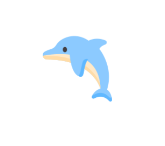

## Team. 물보라를 일으켜🌊🌊🌊

### 2023.06.28 - 2023.07.24

### 🔗 배포주소 : [Splash Zone](https://jolly-kringle-b6ed45.netlify.app/)

 

## 👨‍👨‍👧‍👧 Team List
|||||||
|:---:|:---:|:---:|:---:|:---:|:---:|
|[이현석](https://github.com/RINORINORINORINO)|[문종후](https://github.com/Moonjonghoo)|[박광민](https://github.com/mogisilta)|[이에스더](https://github.com/devhanda)|[강예은](https://github.com/coder-bendany)|[백서현](https://github.com/Seohyun-Back)|
|FE Leader|FE|FE|BE Leader|BE|BE|

 

## 🐳 구현 기능

 - JWT 토큰 인증 기반 회원가입, 로그인
 - 커뮤니티 자유게시판, 모임게시판 게시글 및 댓글 작성
 - 게시글 태그별 조회
 - 게시글 키워드 검색
 - 게시글 좋아요 기능 및 좋아요순 인기글 조회
 - 매일 운동 기록을 남길 수 있는 캘린더 Tracker
 - 마이페이지 내 회원 정보 수정
 - 마이페이지 내 회원이 작성한 게시글, 댓글 조회
 - s3 버킷 이미지 연동(프로필 이미지)
 - AWS EC2 배포 환경 구축
 - AWS RDS 연동(Mysql)
 - github actions 배포 자동화
 - Dolphin 유저 레벨링 구현

 

## 💻 Stacks Used

### Front-end

|                                                                                    Html                                                                                     |                                                                          CSS                                                                          |                                                JavaScript                                                |                                                 React-Toolkit                                                  |                                        tw-Styled Components                                         |                                                                    esLint                                                                    |                                                  Figma                                                  |                                                    React Router                                                    |
| :-------------------------------------------------------------------------------------------------------------------------------------------------------------------------: | :---------------------------------------------------------------------------------------------------------------------------------------------------: | :------------------------------------------------------------------------------------------------------: | :------------------------------------------------------------------------------------------------------------: | :----------------------------------------------------------------------------------------------------: | :------------------------------------------------------------------------------------------------------------------------------------------: | :-----------------------------------------------------------------------------------------------------: | :-------------------------------------------------------------------------------------------------------------------: |
|  |  |  |  |  |  |  |  |

 

### Back-end

|                                                                              Java                                                                               |                                                       Spring                                                       |                                                    Spring Boot                                                     |                                                                                                                           Spring Security                                                                                                                            |                                                                              MySQL                                                                               |                                                                              AWS                                                                               |
| :-------------------------------------------------------------------------------------------------------------------------------------------------------------: | :----------------------------------------------------------------------------------------------------------------: | :----------------------------------------------------------------------------------------------------------------: | :------------------------------------------------------------------------------------------------------------------------------------------------------------------------------------------------------------------------------------------------------------------: | :--------------------------------------------------------------------------------------------------------------------------------------------------------------: | :------------------------------------------------------------------------------------------------------------------------------------------------------------: |
| 

 |  |  |  | 

 | 

 |

 

### Tools

|                                                   Github                                                    |                                                                                       Discord                                                                                        |                                                                                   Notion                                                                                    |
| :---------------------------------------------------------------------------------------------------------: | :----------------------------------------------------------------------------------------------------------------------------------------------------------------------------------: | :-------------------------------------------------------------------------------------------------------------------------------------------------------------------------: |
|  |  |  |

 

## 📸 Service info

 

## 🔖 Project Docs

### [사용자 요구사항 정의서](https://www.notion.so/codestates/00c2869c9d7240de84e1c3525b6e4dad?pvs=4)

### [화면 정의서](https://www.figma.com/embed?embed_host=notion&url=https%3A%2F%2Fwww.figma.com%2Ffile%2FAix7izps6UHygsQRvl7NbB%2F%EB%AC%BC%EB%B3%B4%EB%9D%BC%EB%A5%BC-%EC%9D%BC%EC%9C%BC%EC%BC%9C-%ED%99%94%EB%A9%B4%EB%AA%85%EC%84%B8%EC%84%9C%3Ftype%3Ddesign%26node-id%3D0-1%26mode%3Ddesign)

### [ERD](https://www.notion.so/codestates/ERD-73113f10c95e454a8f14dc14e73432f8?pvs=4)

### [API 명세서](https://www.notion.so/codestates/API-ee1edaa3835b4cb9962406f1eb298095?pvs=4)

 

## Github Rule

### Commit Convention

|  Message   | 설명                                     |
| :--------: | :-------------------------------------- |
|   `feat`   | 새로운 기능                                |
|   `fix`    | 버그 수정                                 |
|   `docs`   | 문서 수정                                 |
|  `style`   | 코드 스타일 변경, 기능 수정이 없는 경우          |
|  `design`  | 사용자 UI 디자인 변경                        |
|   `test`   | 테스트 코드, 리펙토링 테스트 코드 추가           |
| `refactor` | 코드 리팩토링                              |
|  `build`   | 빌드 파일 수정                             |
|   `perf`   | 성능 개선                                 |
|  `rename`  | 파일 혹은 폴더명을 수정만 한 경우               |
|    `add`   | 파일을 추가만 한 경우                        |
|  `remove`  | 파일을 삭제만 한 경우                        |
|   `init`   | 파일을 삭제만 한 경우                        |
|   `etc`    | 초기 환경 설정 세팅                          |

 
